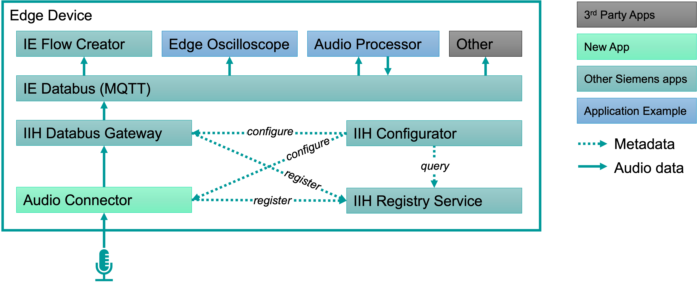
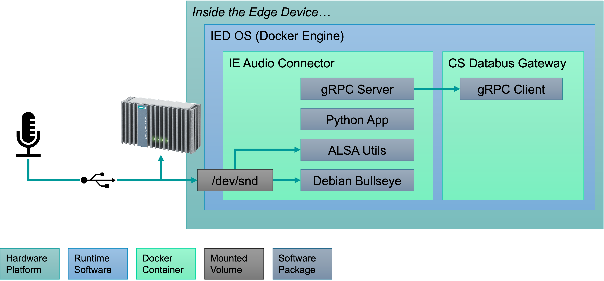
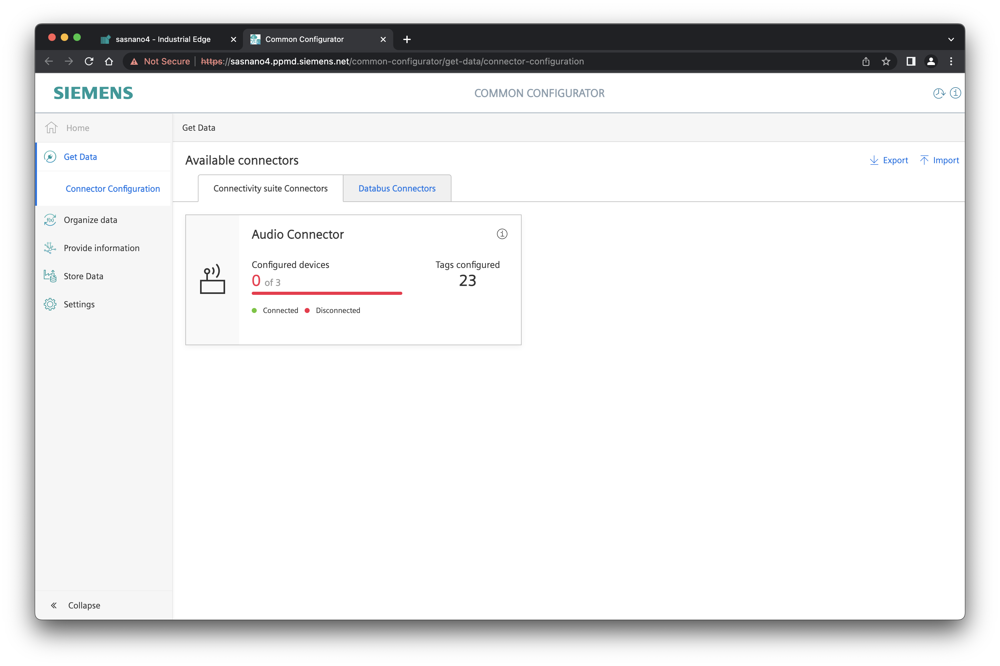
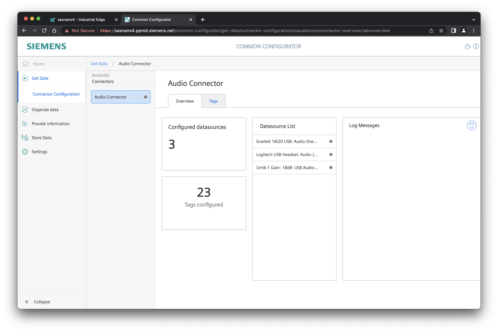
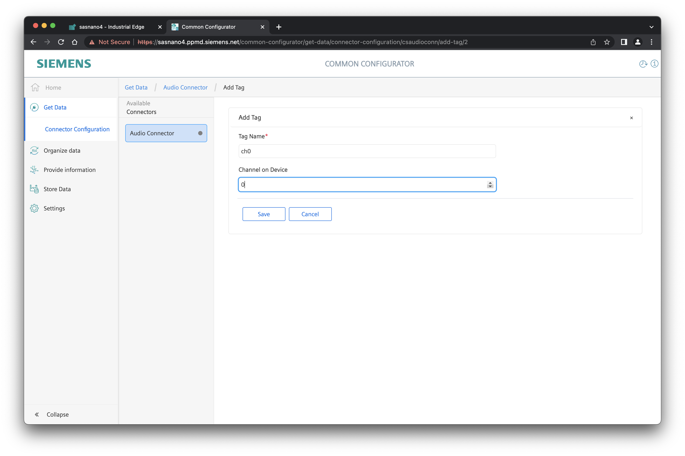
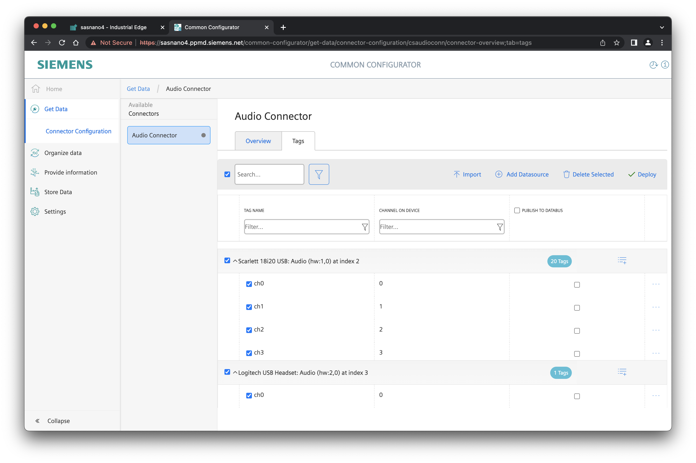
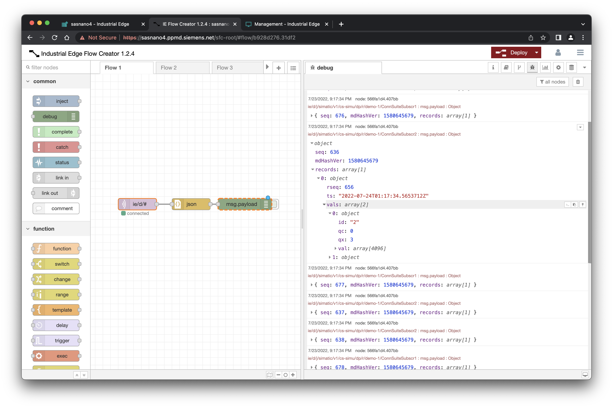
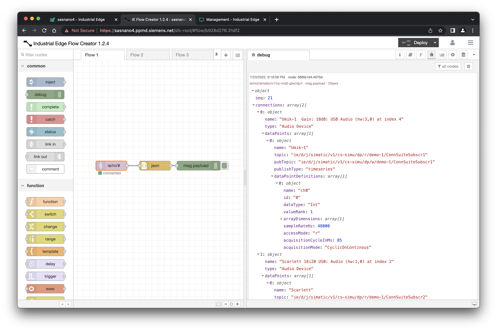

# Audio Connector

The **Audio Connector** is one component of an ecosystem of Edge apps that enable acoustic data collection and analytics on Siemens Industrial Edge.

As seen in this diagram, configuration and operation of the **Audio Connector** is dependent on several other components,
all of which are part of the **Industrial Information Hub (IIH)** on Siemens Industrial Edge.

## Installation

To install the **Audio Connector**, first you must purchase a license through the [IE Marketplace](https://www.dex.siemens.com/edge/manufacturing-process-industries)
or the [Industry Mall](https://mall.industry.siemens.com/mall/en/us/Catalog/Products/10364120).
Then, copy the app from your IE Hub into your IE Management Catalog.
You may now install the app as normal onto your Edge device.
Configuration of the app at this stage is optional;
if no configuration is provided, the **Audio Connector** will automatically generate a valid configuration for all detected audio devices.

Once installed, hardware access to any connected audio devices is implemented through the Linux-native `/dev/snd` volume:

On the same Edge device, also install the **IIH Common Configurator**, the **IIH Registry Service**, and the **IIH Databus Gateway**.
This completes the installation of the **Audio Connector**; you are now ready to configure the app.

## Configuration

Configuration of the **Audio Connector** is handled through the **IIH Common Configurator**.

1. First, open the UI of the **IIH Common Configurator**:

2. Next, select the **Audio Connector**:

3. If your audio device is not already shown, add it as a new datasource:

**Note**: all audio devices discovered by the **Audio Connector** will be listed in the `dev_log.json` file,
which can be downloaded from the app management page of the IED.
This list is updated upon restart of the **Audio Connector**.

4. Now, add tags to that connection:

**Note**: device channels start at `0`.

5. Select the tags you which to configure for each audio device, and deploy:

## Operation

To verify that the **Audio Connector** is functioning properly, we can use **IE Flow Creator** to monitor the traffic on the **IE Databus**:

Similarly, we can browse the connection metadata on the **IE Databus**:

To visualize the audio datastream as a real-time waveform, you can use the [Edge Oscilloscope](../edge-oscilloscope/README.md) app.

## Applications

### Edge Oscilloscope

The **Edge Oscilloscope** is an example application provided for free on Siemens Industry Online Support (SIOS).
Additional instructions can be found [here](../edge-oscilloscope/README.md)

### Audio Processor

The **Audio Processor** is an example application provided as open source in this repository.
Additional instructions can be found [here](../audio-processor/README.md)

## Resources

- [Audio Connector Manual](https://support.industry.siemens.com/cs/ww/en/view/109805476)
- [Common Configurator Manual](https://support.industry.siemens.com/cs/ww/en/view/109803582)
- [Edge Oscilloscope Download](https://support.industry.siemens.com/cs/us/en/view/109808369)