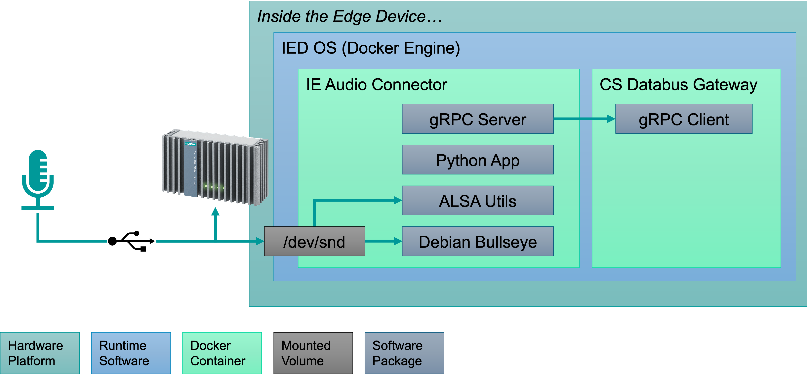

# Audio Connector

The **Audio Connector** is one component of an ecosystem of Edge apps that enable acoustic data collection and analytics on Siemens Industrial Edge.

## Installation

To install the **Audio Connector**, first you must purchase a license through the [IE Marketplace](https://www.dex.siemens.com/edge/manufacturing-process-industries)
or the [Industry Mall](https://mall.industry.siemens.com/mall/en/us/Catalog/Products/10364120).
Then, copy the app from your IE Hub into your IE Management Catalog.
You may now install the app as normal onto your Edge device.
Configuration of the app at this stage is optional;
if no configuration is provided, the **Audio Connector** will automatically generate a valid configuration for all detected audio devices.

Once installed, hardware access to any connected audio devices is implemented through the Linux-native `/dev/snd` volume:

## Configuration

Configuration of the **Audio Connector** is handled through the **IIH (Industrial Information Hub) Common Configurator**.

## Operation

## Applications

### Edge Oscilloscope

The **Edge Oscilloscope** is an example application provided for free on Siemens Industry Online Support (SIOS).
Additional instructions can be found [here](../edge-oscilloscope/README.md)

### Audio Processor

The **Audio Processor** is an example application provided as open source in this repository.
Additional instructions can be found [here](../audio-processor/README.md)

## Resources

- [Audio Connector Manual](https://support.industry.siemens.com/cs/ww/en/view/109805476)
- [Common Configurator Manual](https://support.industry.siemens.com/cs/ww/en/view/109803582)
- [Edge Oscilloscope Download](https://support.industry.siemens.com/cs/us/en/view/109808369)