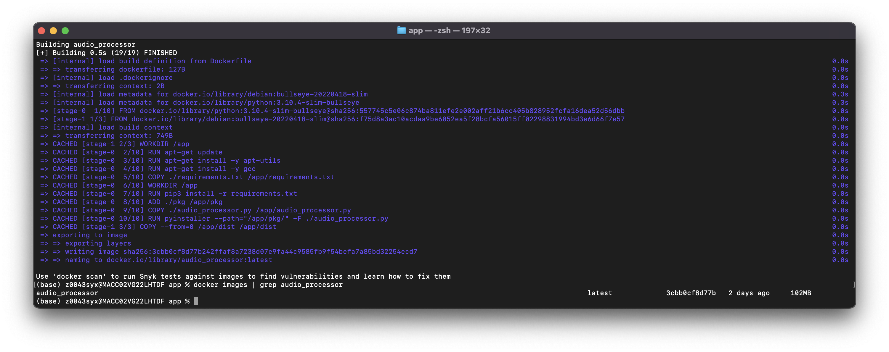
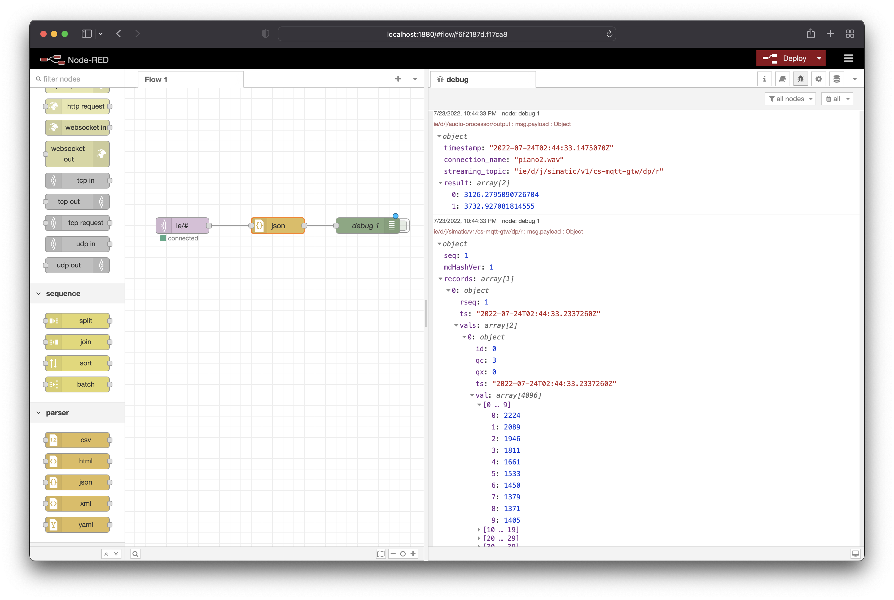
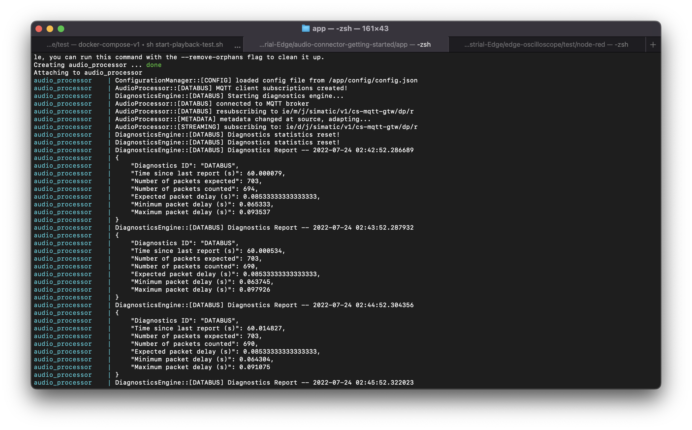

# Audio Processor Example

## Build the application

### Clone the repository

- Clone or Download the source code repository to your engineering VM, e.g.:
```
git clone git@github.com:industrial-edge/audio-connector-getting-started.git
```

### Build the docker image

To build the **Audio Processor** docker image:

- Open console in the source code folder `cd ./app`
- Use command `docker-compose build` to create the docker image.
- This docker image can now be used to build you app with the Industrial Edge App Publisher
- *docker images | grep audio_processor* can be used to check for the images
- You should get a result similiar to this:



### Test the app locally

An audio file playback program is provided in the `./test/playback` directory
which emulates a data stream from an audio device, as if provided by the **Audio Connector**.
This playback program can be used to verify the data flow through the **Audio Processor**.

First, configure the **Audio Processor** to match that of the playback program,
found [here](../../test/playback/config/config.json):
```json
{
    "file_name": "piano2.wav",
    "frame_size": 4096,
    "databus": {
        "databus_host": "ie-databus",
        "databus_port": 1883,
        "databus_username": "edge",
        "databus_password": "edge",
        "metadata_qos": 1,
        "streaming_qos": 2,
        "metadata_topic": "ie/m/j/simatic/v1/cs-mqtt-gtw/dp/r",
        "streaming_topic": "ie/d/j/simatic/v1/cs-mqtt-gtw/dp/r"
    }
}
```
The `connection_name` for the **Audio Processor** must match the playback `file_name`,
as well as the databus credentials and the `metadata_topic`.

A sample audio file called `piano2.wav` is provided in the `./test/playback/data` directory of this repository.
This sample file was obtained from: https://www.kozco.com/tech/soundtests.html

If you wish to use another audio file for testing, simply place it in the `./test/playback/data` directory and
modify the `file_name` field in the [config.json](../../test/playback/config/config.json) file.

Then, to run the full test, simply run the following script from the `./test` directory of this repository:
```sh
sh start-playback-test.sh
```
This builds and runs both the audio file playback program and the **Audio Processor** app.

## Upload App to the Industrial Edge Managment

Please find below a short description how to publish your application in your IEM.

For more detailed information please see the section for [uploading apps to the IEM](https://github.com/industrial-edge/upload-app-to-iem).

### Connect your Industrial Edge App Publisher

- Connect your Industrial Edge App Publisher to your docker engine
- Connect your Industrial Edge App Publisher to your Industrial Edge Managment System

### Upload App using the Industrial Edge App Publisher

- Create a new application using the Industrial Publisher
- Add a new version
- Add a new configuration at `./config/` using this [config.json](../../app/config/config.json) as a template
- Import the [docker-compose](../../app/docker-compose.yml) file using the **Import YAML** button
- **Start Upload** to transfer the app to Industrial Edge Managment
- Further information about using the Industrial Edge App Publisher can be found in the [IE Hub](https://iehub.eu1.edge.siemens.cloud/documents/appPublisher/en/start.html)

## Deploy the App

### Configure the App

Configuration of the audio processor is specified in this [config.json](../../app/config/config.json) file:

```json
{
    "connection_name": "piano2.wav",
    "databus":{
        "databus_host": "ie-databus",
        "databus_port": 1883,
        "databus_username": "edge",
        "databus_password": "edge",
        "metadata_qos": 1,
        "streaming_qos": 2,
        "output_qos": 0,
        "metadata_topic": "ie/m/j/simatic/v1/cs-mqtt-gtw/dp/r",
        "output_topic": "ie/d/j/audio-processor/output"
    }
}
```

### Verify operation

To verify that the **Audio Processor** is working properly, we can use **IE Flow Creator** to view the traffic on the **IE Databus**.
Results of the processed audio frames will be published onto `ie/d/j/audio-processor/output`, e.g.:
```json
{
    "timestamp":"2022-07-24T02:47:01.9981570Z",
    "connection_name":"piano2.wav",
    "streaming_topic":"ie/d/j/simatic/v1/cs-mqtt-gtw/dp/r",
    "result":[
        2779.5262451030744,
        2742.225205091561
        ]
}
```

Using a `debug` node in **IE Flow Creator**, we can view both the raw input data stream as well as the processed output:



Additionally, the **Audio Processor** logs include periodic diagnostics reports which can be used to measure throughput or detect any packet loss:


